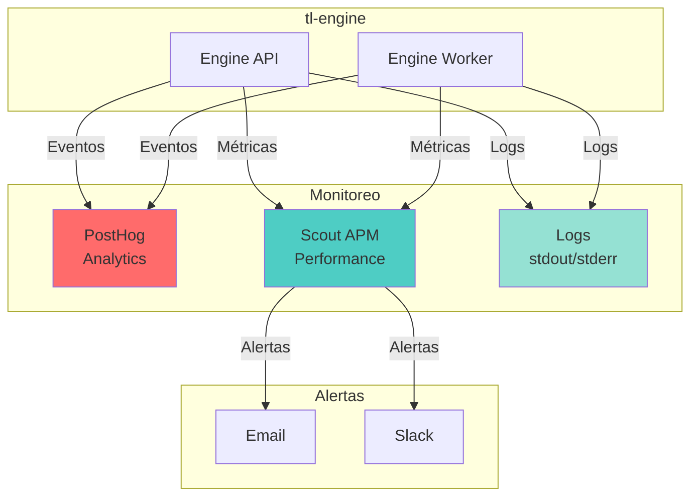

# 📊 Integraciones - Monitoreo

## 📊 Diagrama de Integraciones de Monitoreo



## 📈 PostHog - Analytics

### **Configuración**
- **Proveedor**: PostHog
- **Variables**: `POSTHOG_API_KEY`, `POSTHOG_HOST`
- **Uso**: Tracking de eventos y analytics

### **Integración**
```python
from posthog import Posthog

posthog = Posthog(
    project_api_key=os.environ.get('POSTHOG_API_KEY'),
    host=os.environ.get('POSTHOG_HOST', 'https://app.posthog.com')
)

# Track evento
posthog.capture(
    distinct_id='engine-123',
    event='engine_executed',
    properties={
        'engine_id': 'engine-123',
        'duration_ms': 150,
        'status': 'success'
    }
)
```

### **Eventos a Trackear**
- `engine_executed`: Cuando se ejecuta un engine
- `engine_failed`: Cuando falla un engine
- `api_request`: Requests a la API
- `worker_task`: Tareas del worker

---

## 🔍 Scout APM - Performance Monitoring

### **Configuración**
- **Proveedor**: Scout APM
- **Variables**: `SCOUT_KEY`, `SCOUT_MONITOR`
- **Uso**: Monitoreo de performance

### **Integración**
```python
# Django/FastAPI
# Scout se integra automáticamente con la variable SCOUT_KEY

# En settings/config
SCOUT_KEY = os.environ.get('SCOUT_KEY')
SCOUT_MONITOR = os.environ.get('SCOUT_MONITOR', 'true') == 'true'
```

### **Métricas Monitoreadas**
- Response time
- Throughput
- Error rate
- Database queries
- External API calls

---

## 📝 Logging

### **Configuración**
- **Formato**: JSON estructurado
- **Output**: stdout/stderr
- **Niveles**: DEBUG, INFO, WARNING, ERROR

### **Integración**
```python
import logging
import json

# Configurar logger
logging.basicConfig(
    level=logging.INFO,
    format='%(asctime)s %(name)s %(levelname)s %(message)s'
)

logger = logging.getLogger('tl-engine')

# Log estructurado
logger.info('Engine executed', extra={
    'engine_id': 'engine-123',
    'duration_ms': 150,
    'status': 'success'
})
```

### **Logs Importantes**
- Requests a la API
- Ejecución de engines
- Errores y excepciones
- Tareas del worker
- Conexiones a servicios remotos

---

## 🚨 Alertas

### **Configuración**
- **Canal**: Email, Slack
- **Condiciones**: Error rate > 5%, Response time > 1s
- **Fuente**: Scout APM, Logs

### **Alertas Configuradas**
- Error rate alto (> 5%)
- Response time alto (> 1s)
- Servicios remotos caídos
- Rate limit excedido
- Disco lleno (si aplica)

---

## 📋 Checklist de Monitoreo

- [ ] PostHog configurado y funcionando
- [ ] Scout APM configurado y funcionando
- [ ] Logging estructurado implementado
- [ ] Alertas configuradas
- [ ] Dashboard de métricas creado
- [ ] Logs centralizados (opcional)

---

## 🔗 Referencias

- [Servicios Remotos](./servicios-remotos.md)
- [Sistemas Externos](./sistemas-externos.md)


