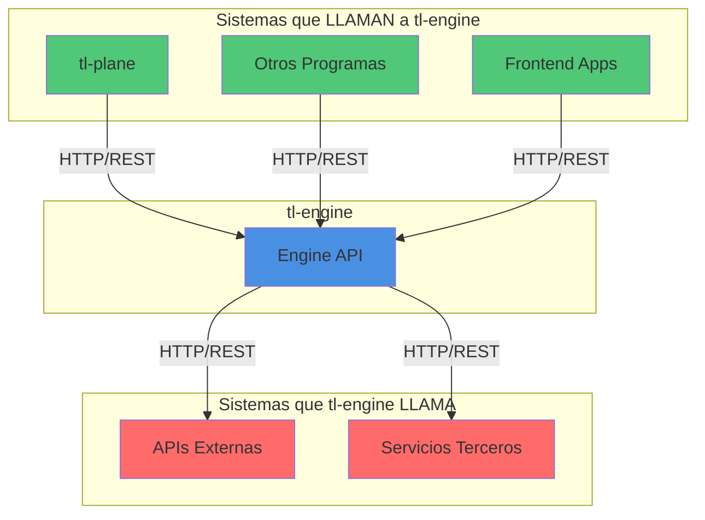
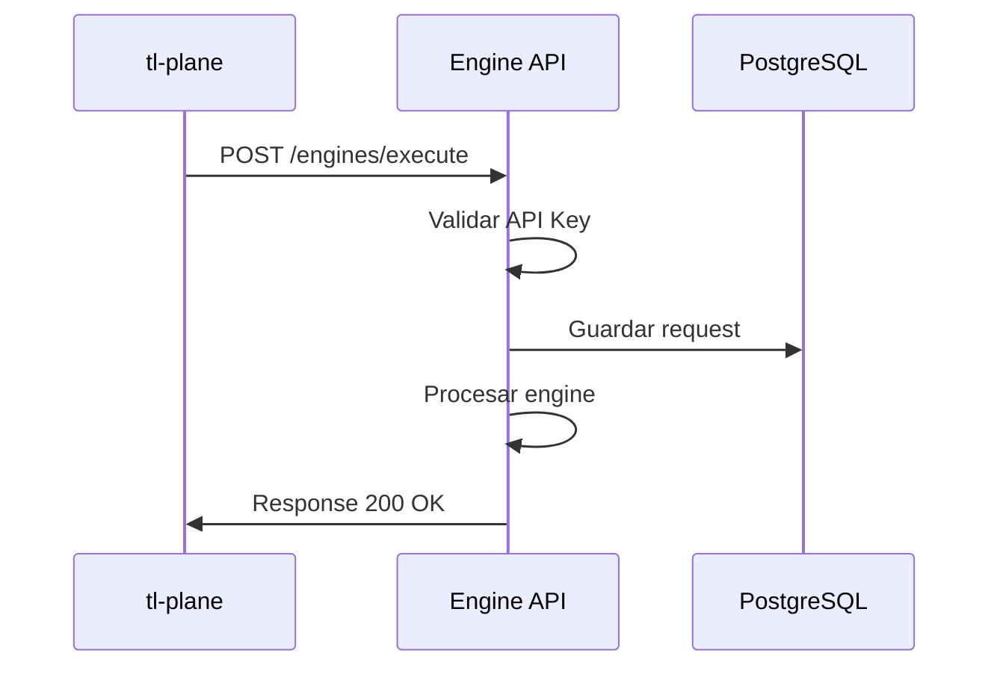
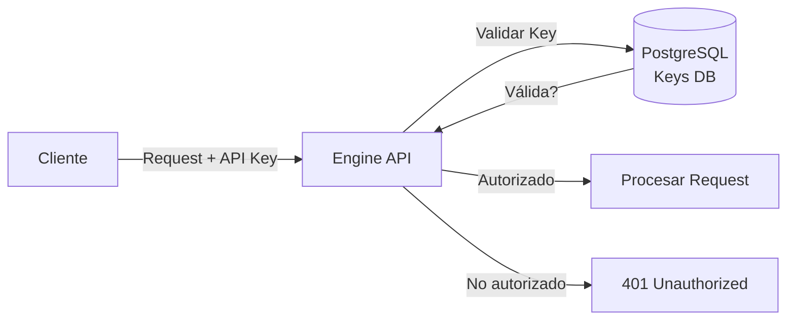

# 🔗 Integraciones - Sistemas Externos

## 📊 Diagrama de Integraciones Externas



## 🔄 Integraciones Entrantes (Quienes llaman a tl-engine)

### **tl-plane**

#### **Tipo de Integración**
- **Protocolo**: HTTP/REST
- **Autenticación**: API Keys
- **Formato**: JSON

#### **Endpoints Principales**
```
POST /api/v1/engines/execute
GET  /api/v1/engines/status
GET  /api/v1/engines/metrics
```

#### **Flujo**


#### **Autenticación**
```python
# tl-engine valida API Key
API_KEY = os.environ.get('TL_PLANE_API_KEY')
# En header: X-API-Key: <key>
```

---

### **Otros Programas**

#### **Tipo de Integración**
- **Protocolo**: HTTP/REST
- **Autenticación**: API Keys (por programa)
- **Formato**: JSON

#### **Endpoints**
```
POST /api/v1/engines/{engine_id}/execute
GET  /api/v1/engines/{engine_id}/status
```

#### **Autenticación**
- Cada programa tiene su propia API Key
- Keys almacenadas en PostgreSQL
- Rate limiting por API Key

---

### **Frontend Apps**

#### **Tipo de Integración**
- **Protocolo**: HTTP/REST
- **Autenticación**: JWT tokens
- **Formato**: JSON

#### **Endpoints**
```
GET  /api/v1/engines
GET  /api/v1/engines/{id}
POST /api/v1/engines/{id}/execute
```

---

## 🌐 Integraciones Salientes (Quienes llama tl-engine)

### **APIs Externas**

#### **Tipo de Integración**
- **Protocolo**: HTTP/REST
- **Autenticación**: API Keys / OAuth
- **Formato**: JSON

#### **Ejemplos**
- APIs de terceros para procesamiento
- Servicios de notificación
- Webhooks externos

#### **Implementación**
```python
import requests

def call_external_api(url, data, api_key):
    headers = {
        'Authorization': f'Bearer {api_key}',
        'Content-Type': 'application/json'
    }
    response = requests.post(url, json=data, headers=headers)
    return response.json()
```

---

### **Servicios Terceros**

#### **Tipo de Integración**
- **Protocolo**: HTTP/REST, WebSockets, gRPC
- **Autenticación**: Depende del servicio
- **Formato**: JSON, Protocol Buffers

#### **Ejemplos**
- Servicios de análisis
- Servicios de transformación de datos
- Servicios de validación

---

## 🔐 Autenticación y Autorización

### **API Keys**



#### **Implementación**
```python
# Validar API Key
def validate_api_key(api_key):
    # Consultar en PostgreSQL
    key = db.query(APIKey).filter_by(key=api_key).first()
    if key and key.is_active:
        return True
    return False
```

---

### **Rate Limiting**

#### **Por API Key**
- Límite: 1000 requests/hora por key
- Almacenado en Redis
- Headers de respuesta: `X-RateLimit-Limit`, `X-RateLimit-Remaining`

#### **Implementación**
```python
# Rate limiting con Redis
def check_rate_limit(api_key):
    key = f"engine:ratelimit:{api_key}"
    count = redis_client.incr(key)
    if count == 1:
        redis_client.expire(key, 3600)  # 1 hora
    if count > 1000:
        return False
    return True
```

---

## 📋 Checklist de Integraciones

### **Integraciones Entrantes**
- [ ] API para tl-plane
- [ ] API para otros programas
- [ ] API para frontend apps
- [ ] Autenticación por API Keys
- [ ] Rate limiting configurado

### **Integraciones Salientes**
- [ ] Cliente HTTP para APIs externas
- [ ] Manejo de errores y retries
- [ ] Timeouts configurados
- [ ] Logging de requests externos

---

## 🔗 Referencias

- [Servicios Remotos](./servicios-remotos.md)
- [Monitoreo](./monitoreo.md)


