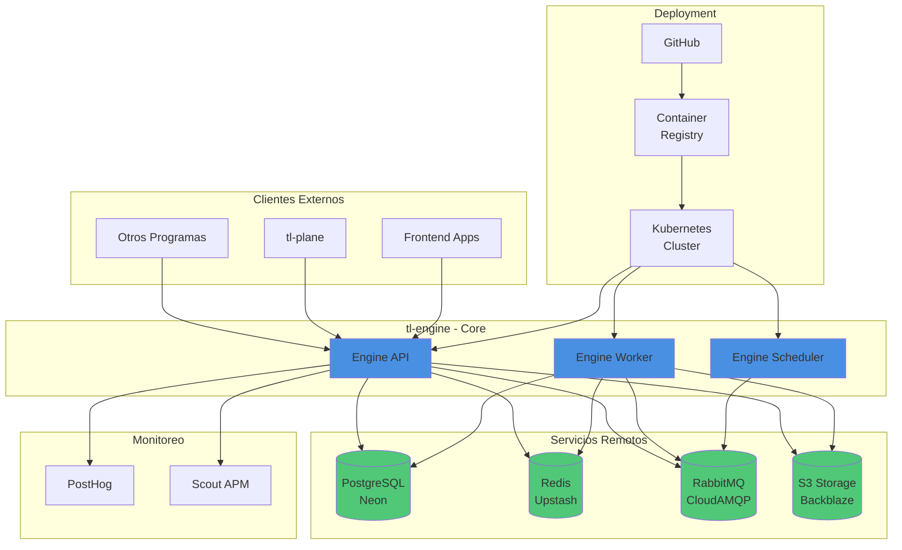

# 🏗️ Vista General - Infraestructura tl-engine

## 📊 Diagrama de Arquitectura General

## 🎯 Componentes Principales

### **tl-engine Core**
- **Engine API**: API REST principal que recibe requests
- **Engine Worker**: Procesamiento asíncrono de tareas
- **Engine Scheduler**: Tareas programadas (cron jobs)

### **Servicios Remotos**
- **PostgreSQL**: Base de datos principal (Neon)
- **Redis**: Cache y sesiones (Upstash)
- **RabbitMQ**: Message queue (CloudAMQP)
- **S3 Storage**: Almacenamiento de archivos (Backblaze)

### **Monitoreo**
- **PostHog**: Analytics y eventos
- **Scout APM**: Performance monitoring

### **Deployment**
- **Kubernetes**: Orquestador de contenedores
- **GitHub**: Control de versiones y CI/CD
- **Container Registry**: Almacenamiento de imágenes Docker

## 📋 Flujo de Datos

1. **Clientes externos** hacen requests a **Engine API**
2. **Engine API** consulta/cachea en **Redis**
3. **Engine API** persiste en **PostgreSQL**
4. **Tareas asíncronas** van a **RabbitMQ**
5. **Engine Worker** procesa tareas de **RabbitMQ**
6. **Archivos** se almacenan en **S3**
7. **Métricas** se envían a **PostHog** y **Scout APM**

## 🔗 Integraciones

Ver documentación detallada en:
- [Integraciones con Servicios Remotos](./integraciones/servicios-remotos.md)
- [Integraciones con Otros Sistemas](./integraciones/sistemas-externos.md)
- [Integraciones de Monitoreo](./integraciones/monitoreo.md)

## 📚 Documentación Técnica

Ver documentación técnica sobre tecnologías:
- [Kubernetes (K8s)](../meta/k8/README.md) - Cómo K8s gestiona cada servicio
- [RabbitMQ](../meta/rabbitmq/README.md) - Configuración y uso
- [PostgreSQL](../meta/postgresql/README.md) - Configuración
- [Redis](../meta/redis/README.md) - Configuración

