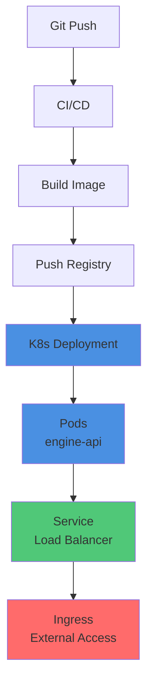
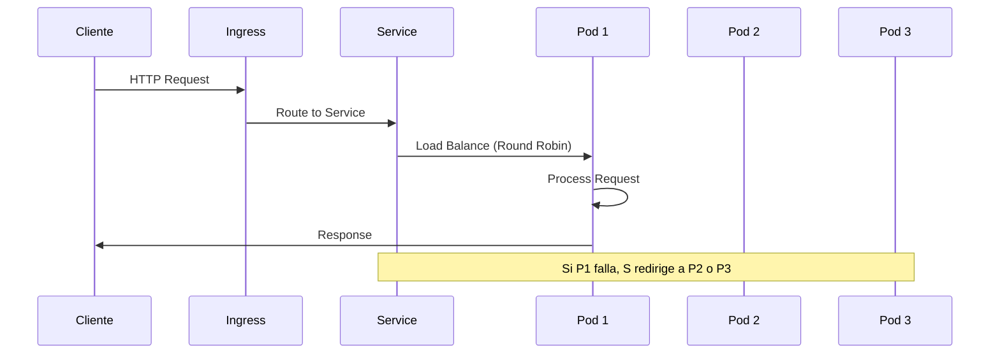

# 🚀 Kubernetes + Engine API

## 📊 ¿Cómo K8s despliega Engine API?



## 🏗️ Componentes K8s

### **1. Deployment**
Gestiona réplicas de pods de la API.

```yaml
apiVersion: apps/v1
kind: Deployment
metadata:
  name: engine-api
spec:
  replicas: 3  # 3 pods de la API
  selector:
    matchLabels:
      app: engine-api
  template:
    metadata:
      labels:
        app: engine-api
    spec:
      containers:
      - name: api
        image: tl-engine:latest
        ports:
        - containerPort: 8000
        env:
        - name: DATABASE_URL
          valueFrom:
            secretKeyRef:
              name: postgresql-secret
              key: DATABASE_URL
        - name: REDIS_URL
          valueFrom:
            secretKeyRef:
              name: redis-secret
              key: REDIS_URL
```

**Qué hace:**
- ✅ Crea y gestiona pods
- ✅ Mantiene número de réplicas
- ✅ Auto-restart en fallos
- ✅ Rolling updates

---

### **2. Service**
Expone pods internamente/externamente.

```yaml
apiVersion: v1
kind: Service
metadata:
  name: engine-api-service
spec:
  type: LoadBalancer  # O ClusterIP para interno
  selector:
    app: engine-api
  ports:
  - port: 80
    targetPort: 8000
```

**Qué hace:**
- ✅ Load balancing entre pods
- ✅ DNS interno: `engine-api-service`
- ✅ Exposición externa (si LoadBalancer)

---

### **3. Ingress**
Routing HTTP/HTTPS externo.

```yaml
apiVersion: networking.k8s.io/v1
kind: Ingress
metadata:
  name: engine-api-ingress
spec:
  rules:
  - host: api.tl-engine.com
    http:
      paths:
      - path: /
        pathType: Prefix
        backend:
          service:
            name: engine-api-service
            port:
              number: 80
```

**Qué hace:**
- ✅ Routing por dominio
- ✅ SSL/TLS termination
- ✅ Path-based routing

---

## 🔄 Flujo de Request



---

## 📊 Health Checks

### **Liveness Probe:**
Verifica que el pod está vivo.

```yaml
livenessProbe:
  httpGet:
    path: /health
    port: 8000
  initialDelaySeconds: 30
  periodSeconds: 10
  failureThreshold: 3
```

**Qué hace:**
- ✅ Si falla 3 veces → K8s reinicia el pod
- ✅ Evita pods "zombie"

---

### **Readiness Probe:**
Verifica que el pod está listo para recibir tráfico.

```yaml
readinessProbe:
  httpGet:
    path: /ready
    port: 8000
  initialDelaySeconds: 10
  periodSeconds: 5
```

**Qué hace:**
- ✅ Si falla → K8s quita el pod del Service
- ✅ No recibe tráfico hasta que esté listo

---

## 🔄 Escalado

### **Manual:**
```bash
kubectl scale deployment engine-api --replicas=5
```

### **Automático (HPA):**
```yaml
apiVersion: autoscaling/v2
kind: HorizontalPodAutoscaler
metadata:
  name: engine-api-hpa
spec:
  scaleTargetRef:
    apiVersion: apps/v1
    kind: Deployment
    name: engine-api
  minReplicas: 3
  maxReplicas: 20
  metrics:
  - type: Resource
    resource:
      name: cpu
      target:
        type: Utilization
        averageUtilization: 70
```

**Qué hace:**
- ✅ Escala automáticamente basado en CPU
- ✅ Mínimo 3 pods, máximo 20
- ✅ Escala cuando CPU > 70%

---

## 🔧 Configuración

### **Secrets:**
```yaml
# Variables sensibles
apiVersion: v1
kind: Secret
metadata:
  name: engine-secrets
type: Opaque
stringData:
  SECRET_KEY: "your-secret-key"
  DATABASE_URL: "postgresql://..."
```

### **ConfigMaps:**
```yaml
# Variables no sensibles
apiVersion: v1
kind: ConfigMap
metadata:
  name: engine-config
data:
  DEBUG: "0"
  LOG_LEVEL: "INFO"
  MAX_WORKERS: "10"
```

---

## ✅ Resumen

**K8s gestiona:**
- ✅ Despliegue de pods
- ✅ Load balancing
- ✅ Health checks
- ✅ Auto-scaling
- ✅ Rolling updates
- ✅ Restart en fallos

**La aplicación:**
- ✅ Solo necesita correr en el contenedor
- ✅ Escucha en el puerto configurado
- ✅ Expone endpoints `/health` y `/ready`


