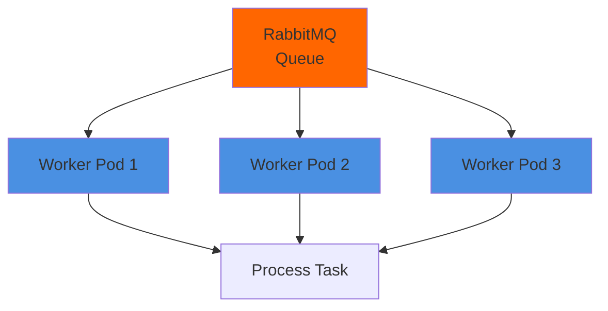
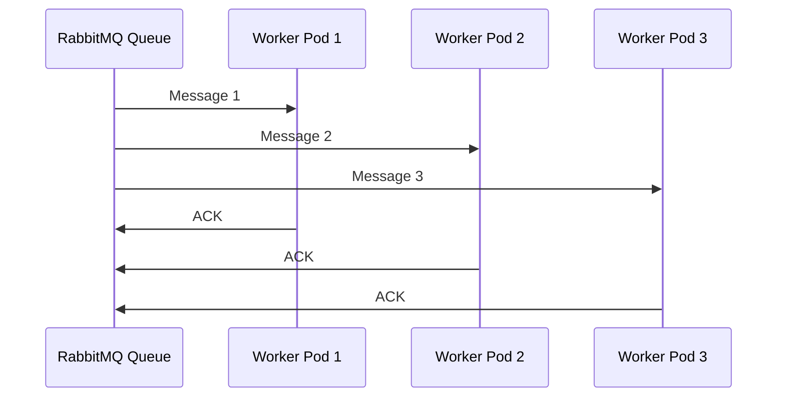

# 👷 Kubernetes + Engine Worker

## 📊 ¿Cómo K8s gestiona Workers?



## 🏗️ Deployment de Workers

### **Configuración Básica:**

```yaml
apiVersion: apps/v1
kind: Deployment
metadata:
  name: engine-worker
spec:
  replicas: 3  # 3 workers consumiendo de la misma queue
  selector:
    matchLabels:
      app: engine-worker
  template:
    metadata:
      labels:
        app: engine-worker
    spec:
      containers:
      - name: worker
        image: tl-engine:latest
        command: ["python", "worker.py"]
        env:
        - name: AMQP_URL
          valueFrom:
            secretKeyRef:
              name: rabbitmq-secret
              key: AMQP_URL
        - name: DATABASE_URL
          valueFrom:
            secretKeyRef:
              name: postgresql-secret
              key: DATABASE_URL
```

**Qué hace:**
- ✅ Crea 3 pods de worker
- ✅ Cada pod consume de RabbitMQ
- ✅ Load balancing automático de mensajes

---

## 🔄 Consumo de Mensajes

### **Cómo funciona:**



**RabbitMQ distribuye mensajes:**
- Round-robin entre workers
- Si un worker falla, mensaje vuelve a la queue
- Otro worker lo procesa

---

## 🔧 Configuración Avanzada

### **Resource Limits:**

```yaml
resources:
  requests:
    memory: "256Mi"
    cpu: "250m"
  limits:
    memory: "512Mi"
    cpu: "500m"
```

**Qué hace:**
- ✅ Reserva recursos mínimos
- ✅ Limita recursos máximos
- ✅ Evita que un worker consuma todo

---

### **Health Checks:**

```yaml
livenessProbe:
  exec:
    command:
    - /bin/sh
    - -c
    - "ps aux | grep worker.py | grep -v grep"
  initialDelaySeconds: 30
  periodSeconds: 10

readinessProbe:
  exec:
    command:
    - /bin/sh
    - -c
    - "python -c 'import pika; pika.BlockingConnection(pika.URLParameters(\"$AMQP_URL\"))'"
  initialDelaySeconds: 10
  periodSeconds: 5
```

**Qué hace:**
- ✅ Liveness: Verifica que el worker está corriendo
- ✅ Readiness: Verifica que puede conectar a RabbitMQ

---

## 🔄 Escalado de Workers

### **Manual:**
```bash
kubectl scale deployment engine-worker --replicas=10
```

### **Automático (HPA):**
```yaml
apiVersion: autoscaling/v2
kind: HorizontalPodAutoscaler
metadata:
  name: engine-worker-hpa
spec:
  scaleTargetRef:
    apiVersion: apps/v1
    kind: Deployment
    name: engine-worker
  minReplicas: 3
  maxReplicas: 50
  metrics:
  - type: Resource
    resource:
      name: cpu
      target:
        type: Utilization
        averageUtilization: 70
```

**Qué hace:**
- ✅ Escala workers basado en CPU
- ✅ Más workers = más mensajes procesados
- ✅ Auto-scaling según carga

---

## 🎯 Estrategias de Escalado

### **Basado en Queue Length:**

```yaml
# Usar custom metrics (requiere Prometheus)
metrics:
- type: Pods
  pods:
    metric:
      name: rabbitmq_queue_length
    target:
      type: AverageValue
      averageValue: "10"  # Escalar si queue > 10 mensajes
```

**Qué hace:**
- ✅ Escala cuando hay muchos mensajes en queue
- ✅ Más preciso que CPU
- ✅ Requiere métricas custom

---

## 🔧 Worker Implementation

### **Código del Worker:**

```python
# worker.py
import pika
import json
import os

AMQP_URL = os.environ.get('AMQP_URL')

connection = pika.BlockingConnection(pika.URLParameters(AMQP_URL))
channel = connection.channel()

channel.queue_declare(queue='engine:tasks', durable=True)

def process_task(ch, method, properties, body):
    task = json.loads(body)
    # Procesar tarea
    result = execute_task(task)
    # ACK
    ch.basic_ack(delivery_tag=method.delivery_tag)

channel.basic_qos(prefetch_count=1)  # Un mensaje por worker
channel.basic_consume(
    queue='engine:tasks',
    on_message_callback=process_task
)

channel.start_consuming()
```

**Qué hace:**
- ✅ Conecta a RabbitMQ
- ✅ Consume mensajes de la queue
- ✅ Procesa tareas
- ✅ ACK cuando termina

---

## ✅ Resumen

**K8s gestiona:**
- ✅ Despliegue de worker pods
- ✅ Escalado automático
- ✅ Health checks
- ✅ Restart en fallos
- ✅ Resource limits

**El worker:**
- ✅ Solo necesita consumir de RabbitMQ
- ✅ Procesar mensajes
- ✅ ACK cuando termina
- ✅ K8s distribuye carga automáticamente


