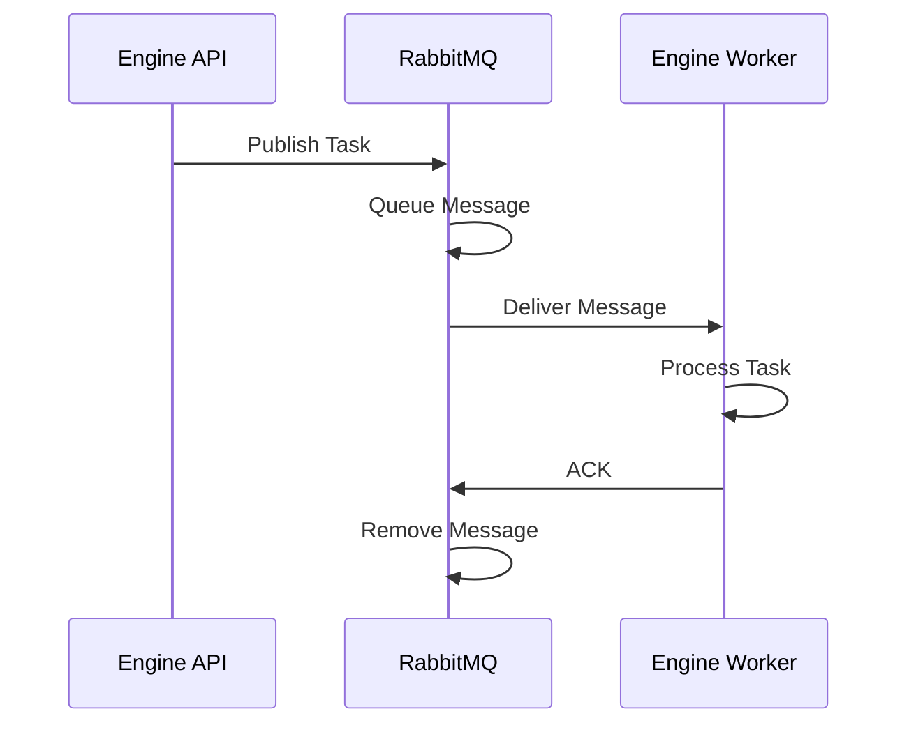

# 🐰 RabbitMQ - Uso en la Aplicación

## 📊 Flujo de Mensajes



## 🔧 Producer (API)

### **Publicar Tarea:**

```python
import pika
import json
import os

AMQP_URL = os.environ.get('AMQP_URL')

connection = pika.BlockingConnection(pika.URLParameters(AMQP_URL))
channel = connection.channel()

# Declarar queue
channel.queue_declare(queue='engine:tasks', durable=True)

# Publicar mensaje
task = {
    'engine_id': 'engine-123',
    'action': 'process',
    'data': {...}
}

channel.basic_publish(
    exchange='',
    routing_key='engine:tasks',
    body=json.dumps(task),
    properties=pika.BasicProperties(
        delivery_mode=2,  # Persistente
    )
)

connection.close()
```

---

## 👷 Consumer (Worker)

### **Consumir Tareas:**

```python
import pika
import json
import os

AMQP_URL = os.environ.get('AMQP_URL')

connection = pika.BlockingConnection(pika.URLParameters(AMQP_URL))
channel = connection.channel()

channel.queue_declare(queue='engine:tasks', durable=True)

def process_task(ch, method, properties, body):
    task = json.loads(body)
    
    try:
        # Procesar tarea
        result = execute_engine_task(task)
        
        # ACK si éxito
        ch.basic_ack(delivery_tag=method.delivery_tag)
    except Exception as e:
        # NACK si falla (reintentar)
        ch.basic_nack(delivery_tag=method.delivery_tag, requeue=True)
        print(f"Error processing task: {e}")

# Un mensaje por worker a la vez
channel.basic_qos(prefetch_count=1)

channel.basic_consume(
    queue='engine:tasks',
    on_message_callback=process_task
)

channel.start_consuming()
```

---

## 🔄 Patrones de Uso

### **1. Task Queue (Tareas Asíncronas)**

```python
# Producer
channel.basic_publish(
    exchange='',
    routing_key='engine:tasks',
    body=json.dumps(task)
)

# Consumer
channel.basic_consume(
    queue='engine:tasks',
    on_message_callback=process_task
)
```

---

### **2. Pub/Sub (Eventos)**

```python
# Producer
channel.exchange_declare(exchange='engine:events', exchange_type='fanout')
channel.basic_publish(
    exchange='engine:events',
    routing_key='',
    body=json.dumps(event)
)

# Consumer
channel.exchange_declare(exchange='engine:events', exchange_type='fanout')
result = channel.queue_declare(queue='', exclusive=True)
queue_name = result.method.queue
channel.queue_bind(exchange='engine:events', queue=queue_name)
channel.basic_consume(
    queue=queue_name,
    on_message_callback=handle_event
)
```

---

### **3. Routing (Por Tipo)**

```python
# Producer
channel.exchange_declare(exchange='engine:routing', exchange_type='direct')
channel.basic_publish(
    exchange='engine:routing',
    routing_key='high-priority',
    body=json.dumps(task)
)

# Consumer
channel.exchange_declare(exchange='engine:routing', exchange_type='direct')
channel.queue_bind(
    exchange='engine:routing',
    queue='engine:tasks',
    routing_key='high-priority'
)
```

---

## ✅ Mejores Prácticas

1. **Durabilidad:**
   - Queues durables
   - Mensajes persistentes (delivery_mode=2)

2. **ACK:**
   - Siempre ACK después de procesar
   - NACK si falla (para reintentar)

3. **Prefetch:**
   - `basic_qos(prefetch_count=1)` para distribución justa

4. **Reconexión:**
   - Manejar desconexiones
   - Reintentar conexión

5. **Error Handling:**
   - Try/except en procesamiento
   - Logging de errores


